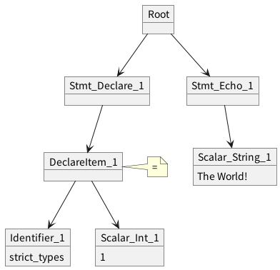
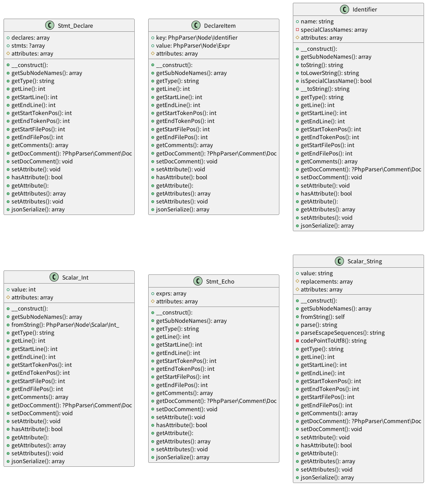

# AST Visualizer
[](https://github.com/hirokinoue/ast-visualizer/actions/workflows/phpunit.yml)

## Overview
AST Visualizer is a tool that visualizes ast created by PHP-Parser.

# Usage
- ast mode
    ```
    ast-visualizer.phar path/to/Foo.php ast
    ```

- node mode
    ```
    ast-visualizer.phar path/to/Foo.php node
    ```

Both modes can be specified at the same time.  
PHP 8.1.0 or higher is required.

# Example
```
<?php declare(strict_types=1);

echo 'The World!';
```
This code is converted to the following diagram.

- ast mode  


- node mode  


# Development
## Run docker
```
make run
```

## Clear docker
```
make clean
```

## Execute AST Visualizer
```
XDEBUG_MODE=off composer ast-visualizer path/to/Foo.php
```

## Build phar file
```
vendor/bin/box compile 
```
